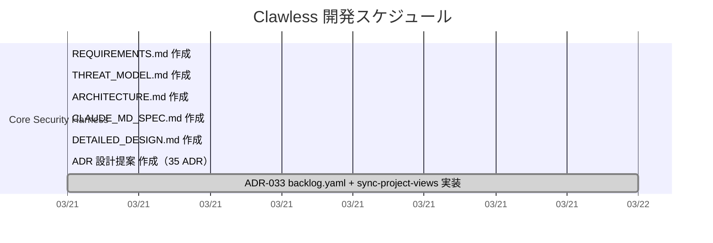

<!-- auto-generated from backlog.yaml. DO NOT EDIT -->
<!-- generated_at: 2026-03-21T10:56:03Z -->

# Clawless ガントチャート

> 自動生成: 2026-03-21T10:56:03Z

```mermaid
gantt
    title Clawless 開発スケジュール
    dateFormat YYYY-MM-DD
    axisFormat %m/%d

    section Core Security Harness
    REQUIREMENTS.md 作成 :done, task_001, 2026-03-21, 2026-03-21
    THREAT_MODEL.md 作成 :done, task_002, 2026-03-21, 2026-03-21
    ARCHITECTURE.md 作成 :done, task_003, 2026-03-21, 2026-03-21
    CLAUDE_MD_SPEC.md 作成 :done, task_004, 2026-03-21, 2026-03-21
    DETAILED_DESIGN.md 作成 :done, task_005, 2026-03-21, 2026-03-21
    ADR 設計提案 作成（35 ADR） :done, task_006, 2026-03-21, 2026-03-21
    ADR-033 backlog.yaml + sync-project-views 実装 :done, task_007, 2026-03-21, 2026-03-22
```
